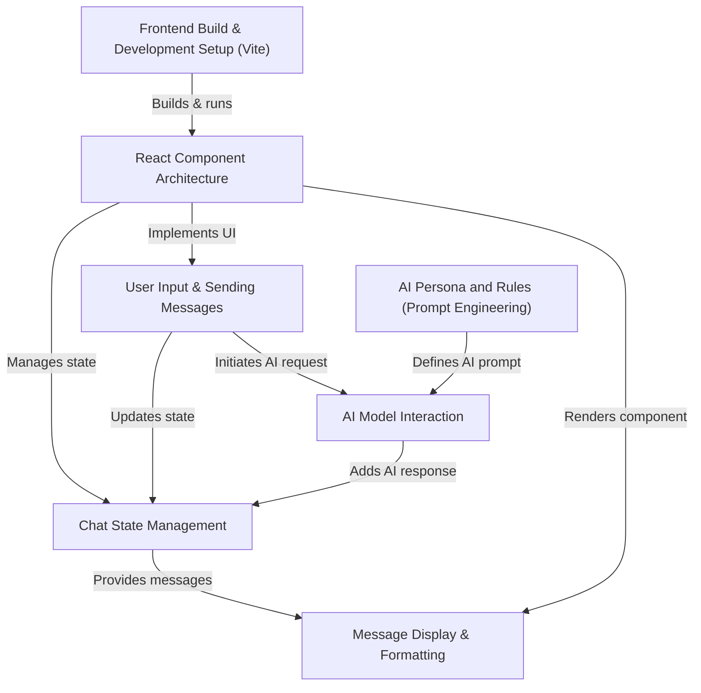
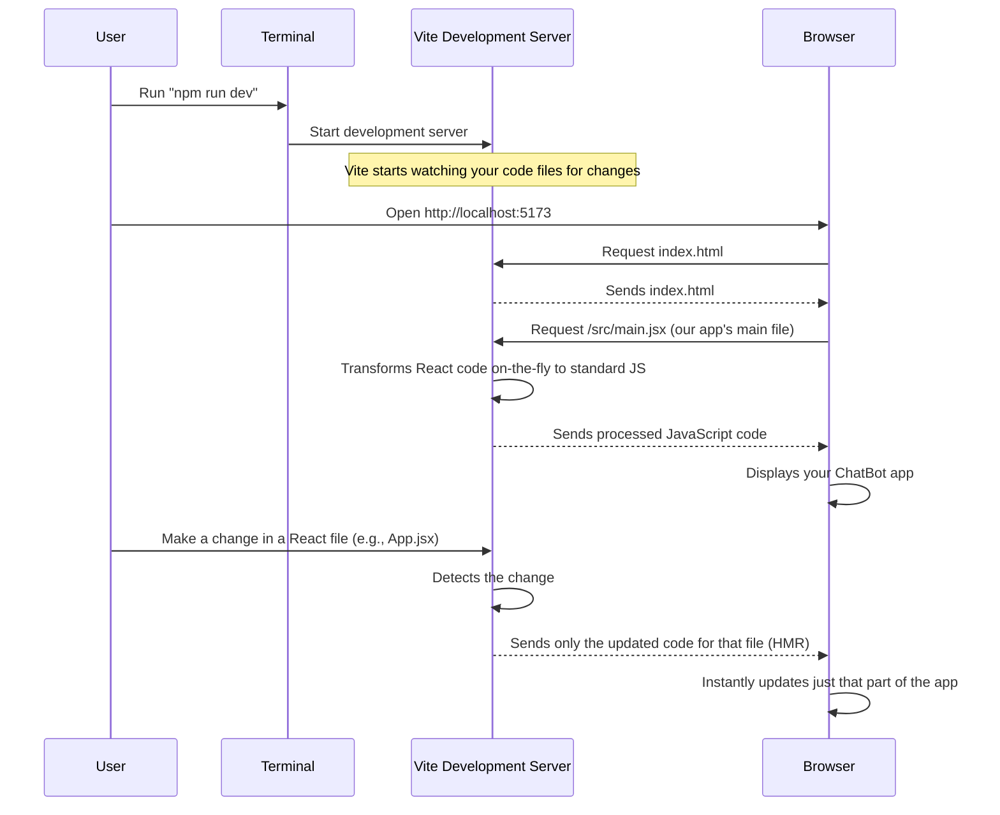

# Tutorial: ChatBot

This project is a **simple chatbot application** where you can *chat with an AI assistant* named EDITH. It lets you type messages and EDITH will reply in a friendly, concise manner, making conversations feel natural. All your messages and EDITH's responses are displayed clearly, keeping the conversation history easy to follow.


## Visual Overview



## Chapters

1. [Frontend Build & Development Setup (Vite)
](01_frontend_build___development_setup__vite__.md)
2. [React Component Architecture
](02_react_component_architecture_.md)
3. [User Input & Sending Messages
](03_user_input___sending_messages_.md)
4. [Chat State Management
](04_chat_state_management_.md)
5. [Message Display & Formatting
](05_message_display___formatting_.md)
6. [AI Model Interaction
](06_ai_model_interaction_.md)
7. [AI Persona and Rules (Prompt Engineering)
](07_ai_persona_and_rules__prompt_engineering__.md)

---

<sub><sup>Generated by [AI Codebase Knowledge Builder](https://github.com/The-Pocket/Tutorial-Codebase-Knowledge).</sup></sub>

# Chapter 1: Frontend Build & Development Setup (Vite)

Welcome to your first chapter in building the ChatBot! Imagine you're building a house. Before you can even think about the furniture or paint colors, you need a strong foundation and a construction crew with their tools and blueprints. This chapter is all about setting up that "foundation" and "crew" for our ChatBot's frontend – the part of the application that users see and interact with in their web browser.

## What Problem Are We Solving?

When you write code for a web application, especially one using modern tools like React (which we'll explore in the [React Component Architecture](02_react_component_architecture_.md) chapter), it's not just a simple HTML file. You'll have many different files:
*   Files written in special JavaScript variants (like JSX for React).
*   Files for styling (CSS).
*   Image files, and so on.

Your web browser doesn't understand all these special files directly. It needs them to be "translated" and "organized" into a format it *can* understand. Also, when you're actively developing, you want to see your changes *instantly* without having to manually refresh the browser every time you type something.

This is where a "frontend build and development setup" comes in. It manages how your web application is built, how it runs efficiently during development, and how it's prepared for the final deployment. Think of it as:

*   **During Development**: A helpful assistant that watches your code, quickly prepares it for the browser, and instantly shows updates as you type. This allows you to rapidly build and test your ChatBot.
*   **For Deployment (Production)**: An optimizer that takes all your code, makes it as small and fast as possible, and bundles it into a few files that web servers can deliver efficiently to users around the world.

Our chosen "construction crew" for this task is **Vite** (pronounced "Vee-t").

## Introducing Vite: Your Super-Fast Development Tool

Vite is a modern "build tool" that helps us develop and package our web applications. It focuses on speed and ease of use. Let's break down some key concepts related to Vite:

### 1. Development Server
This is a special server that runs on your computer while you're coding. It serves your files to the browser and handles things like:
*   **Transforming Code**: Converting your React/JSX code into standard JavaScript that browsers understand.
*   **Hot Module Replacement (HMR)**: This is Vite's superpower! When you make a change to your code, Vite instantly updates *only that specific part* in your browser, without reloading the entire page. It's like changing one ingredient in a recipe and seeing the dish update right away, instead of having to re-cook the whole thing.

### 2. Bundling
When your ChatBot is ready to be shared with the world, Vite takes all your individual code files, images, and styles, and "bundles" them together. This usually means combining them into a few optimized files (like one big JavaScript file, one big CSS file). This makes your application faster to load for users.

### 3. Plugins
Vite uses "plugins" to extend its functionality. For our ChatBot, we're using React, so we need a specific plugin (`@vitejs/plugin-react`) that tells Vite how to handle React's special syntax.

## How to Use Vite for Our ChatBot

You don't need to write complex configurations for Vite to work. Our ChatBot project is already set up to use it. You'll primarily interact with Vite through simple commands in your terminal.

### Starting the Development Server

To start building and seeing your ChatBot in action, you'll use this command:

```bash
npm run dev
```

**What happens:**
1.  You type `npm run dev` in your terminal and press Enter.
2.  Vite starts its development server.
3.  It will usually tell you an address like `http://localhost:5173` where your ChatBot is running.
4.  Open your web browser and go to that address. You'll see your ChatBot!
5.  Now, as you change any React component file (like those we'll discuss in [React Component Architecture](02_react_component_architecture_.md)), Vite will automatically update your browser *instantly* without a full page reload. This makes development incredibly fast.

### Building for Production

When your ChatBot is complete and ready to be deployed so others can use it, you'll use this command:

```bash
npm run build
```

**What happens:**
1.  You type `npm run build` in your terminal and press Enter.
2.  Vite takes all your source code (React components, styles, etc.).
3.  It bundles, minifies (makes smaller), and optimizes everything.
4.  It creates a `dist` folder (short for "distribution") in your project. This folder contains the final, optimized files (HTML, CSS, JavaScript) that are ready to be uploaded to a web server. These files are highly efficient for users to download and run.

## Under the Hood: How Vite Works

Let's peek behind the curtain to understand what's happening.

### Starting Development with `npm run dev`

Here’s a simplified sequence of events when you run `npm run dev` and open your browser:



### Key Configuration Files

Vite uses a few files in your project to understand how to operate.

#### 1. `package.json`: The Project's Instruction Manual

This file lists all the "ingredients" (dependencies like React) and "instructions" (scripts like `dev` and `build`) for your project.

```json
{
  "name": "chatbot",
  "private": true,
  "version": "0.0.0",
  "type": "module",
  "scripts": {
    "dev": "vite",        // This runs the Vite development server
    "build": "vite build",// This builds your app for production
    "preview": "vite preview" // This lets you preview the production build
  },
  "dependencies": {
    "react": "^19.2.0",    // React library, essential for our UI
    "react-dom": "^19.2.0", // React's library to interact with the web browser
    // ... other dependencies for ChatBot features ...
  },
  "devDependencies": {
    "vite": "npm:rolldown-vite@7.2.5", // Vite itself
    "@vitejs/plugin-react": "^5.1.1",  // The plugin that lets Vite understand React
    // ... other development tools ...
  }
}
```
*   The `"scripts"` section is where `npm run dev` and `npm run build` get their actual commands (`vite` and `vite build`).
*   `"dependencies"` are libraries our ChatBot needs to run.
*   `"devDependencies"` are tools we only need *during development*, like Vite itself and its React plugin.

#### 2. `vite.config.js`: Vite's Recipe Book

This file is where we tell Vite how to handle our specific project, especially when working with React.

```javascript
import { defineConfig } from 'vite'
import react from '@vitejs/plugin-react' // We import the React plugin here!

// This is how we configure Vite
export default defineConfig({
  plugins: [react()], // We tell Vite to use the React plugin
})
```
*   `defineConfig` is a helper from Vite to ensure our configuration is correct.
*   `import react from '@vitejs/plugin-react'` brings in the React plugin.
*   `plugins: [react()]` tells Vite: "Hey, when you're processing files, make sure to use the React plugin to understand and transform React code!"

#### 3. `index.html`: The Entry Point

This is the very first file your browser loads when you visit your ChatBot's address. It's like the main door to your application.

```html
<!doctype html>
<html lang="en">
  <head>
    <meta charset="UTF-8" />
    <link rel="icon" type="image/svg+xml" href="/vite.svg" />
    <meta name="viewport" content="width=device-width, initial-scale=1.0" />
    <title>chatbot</title>
  </head>
  <body>
    <div id="root"></div> <!-- This is where our entire React app will be injected! -->
    <script type="module" src="/src/main.jsx"></script> <!-- This line tells the browser where our JavaScript app starts -->
  </body>
</html>
```
*   The `<div id="root"></div>` is a special placeholder. Our React application will "attach" itself to this `div` and display all its content inside it.
*   `<script type="module" src="/src/main.jsx"></script>` is crucial. It tells the browser to load our main JavaScript file (`main.jsx`) as a "module," which is how modern JavaScript code is organized. Vite then intercepts this request during development to process `main.jsx` and any other files it imports.

## Conclusion

You've just learned about the essential "construction crew" and "blueprint" for our ChatBot's frontend: Vite! You now understand what Vite does, why it's so helpful for fast development (thanks to HMR!), and how it prepares your application for deployment. You also saw the basic commands (`npm run dev` and `npm run build`) and the core configuration files (`package.json`, `vite.config.js`, `index.html`) that make it all possible.

In the next chapter, we'll dive into the actual building blocks of our ChatBot's user interface: [React Component Architecture](02_react_component_architecture_.md). We'll start assembling the "rooms" of our house using React!

[Next Chapter: React Component Architecture](02_react_component_architecture_.md)

---

<sub><sup>Generated by [AI Codebase Knowledge Builder](https://github.com/The-Pocket/Tutorial-Codebase-Knowledge).</sup></sub> <sub><sup>**References**: [[1]](https://github.com/Sarvesh-waran/ChatBot/blob/9d226b635fb0cc7176e124234af2c590f84bc9cb/README.md), [[2]](https://github.com/Sarvesh-waran/ChatBot/blob/9d226b635fb0cc7176e124234af2c590f84bc9cb/index.html), [[3]](https://github.com/Sarvesh-waran/ChatBot/blob/9d226b635fb0cc7176e124234af2c590f84bc9cb/package.json), [[4]](https://github.com/Sarvesh-waran/ChatBot/blob/9d226b635fb0cc7176e124234af2c590f84bc9cb/vite.config.js)</sup></sub>
