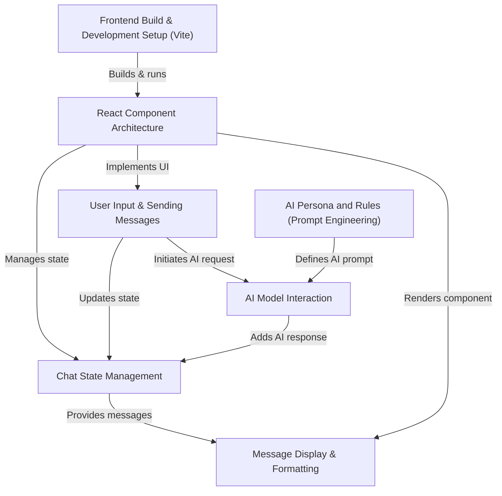

# Tutorial: ChatBot

This project is a **simple chatbot application** where you can *chat with an AI assistant* named EDITH. It lets you type messages and EDITH will reply in a friendly, concise manner, making conversations feel natural. All your messages and EDITH's responses are displayed clearly, keeping the conversation history easy to follow.

## Visual Overview

## Chapters

1. Frontend Build & Development Setup (Vite)
2. React Component Architecture
3. User Input & Sending Messages
4. Chat State Management
5. Message Display & Formatting
6. AI Model Interaction
7. AI Persona and Rules (Prompt Engineering)

---

